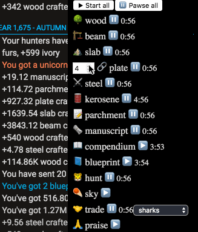

# Lil' Kittens Companion

> 🐱 You are a kitten in a catnip forest...but you're not alone.



## Installation
Paste this in your address bar:
```
javascript:(function(){var d=document,s=d.createElement('script');s.src='https://cdn.rawgit.com/MarkLeMerise/LilKittenCompanion/master/index.js';d.body.appendChild(s);})();
```

## How to use
This helper will craft, hunt, and praise on a regular interval (displayed by the timer).

1. Click any name or icon to adjust the interval (except "sky" which will Just Work, though it becomes obsolete once starcharts are generated automatically). The default is 4 minutes.
1. Use the play/pause buttons (▶️/⏸) to start and stop the helpers.
1. ???
1. Profit!

## Motivation
Build an auto-clicker that did nothing more than the very basics: crafting, hunting, and praising. Eliminiate the mind-numbing clicks while still leaving the main direction to the player. Yes, these tasks can now be somewhat done in-game via engineers but let's be honest, that's just a chunk of your workforce that could be doing other things.

It is up to you to coordinate the timing of the tasks to maximize resource usage and production.

## License

ISC © [Mark LeMerise](https://github.com/MarkLeMerise)